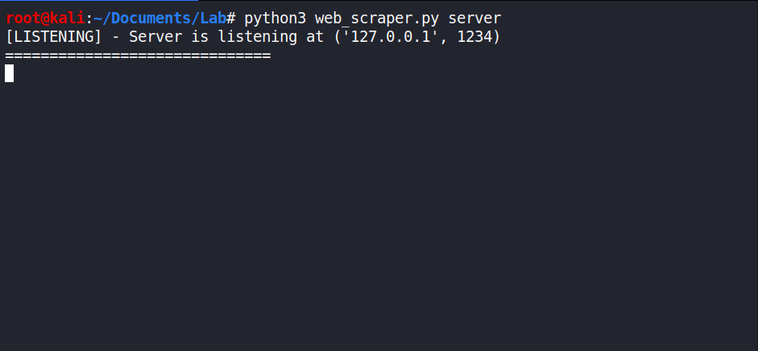
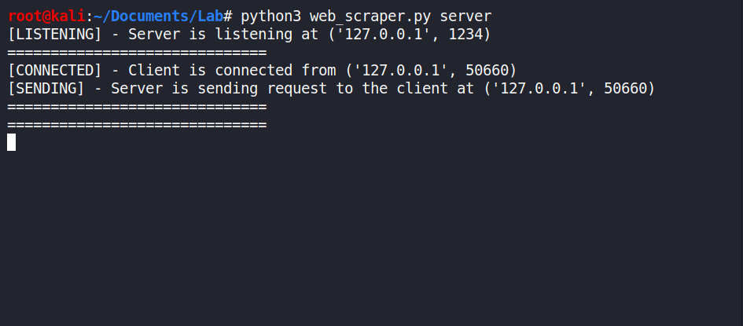
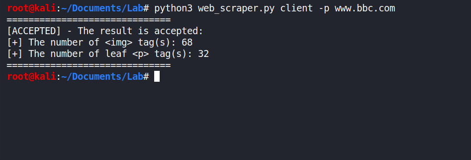

# Lab 3 - Web Scraper


## Task

- The **server** is wait the requests from the client.
- The server finds the number of ``  tag(s).
- The server finds the number of leaf `<p>` tag(s).
- The client send the request to the server.
- All the calculation has done on the server side.


## Usage


### Server Console

```
$ python3 web_scraper.py server
[LISTENING] - Server is listening at ('127.0.0.1', 1234)
==============================
```


### Client Console

```
$ python3 web_scraper.py client -p www.bbc.com
==============================
[ACCEPTED] - The result is accepted:
[+] The number of  tag(s): 68
[+] The number of leaf <p> tag(s): 32
==============================
```


## Requirements

**Python3** is essential to run program.


- Clone the repository

```
$ git clone https://github.com/ahmedvuqarsoy/Network-Programming.git
$ cd Network-Programming
$ cd Lab3-Web-Scraper
$ pip install -r requirements.txt
```


### Requirements.txt

```
beautifulsoup4==4.9.3
requests==2.24.0
requests-toolbelt==0.9.1
urllib3==1.25.10
backports.functools-lru-cache==1.6.1
```


## Images


1. Initial Server State:




2. Server Accepted Request:




3. Client Accepted Result:

