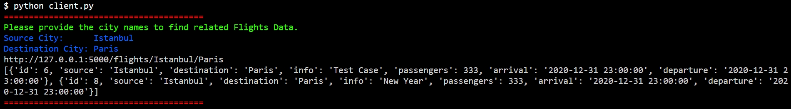
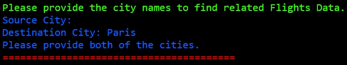
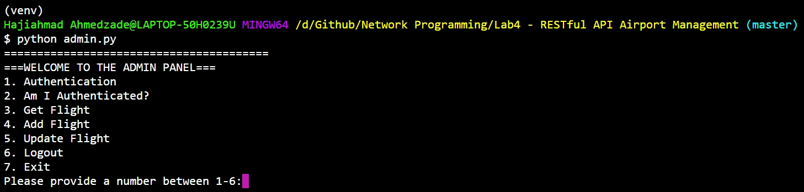

# Lab 4 - Airport Management


## Installation

```
$ git clone https://github.com/ahmedvuqarsoy/Network-Programming.git
```


## Information

This application is client-server-based RESTful **Airport Management System**.

We have some abilities both as a admin and as a client.

The project contains three files.

1. Server.py
2. Client.py
3. Admin.py


## Requirements

If you want to download all the requirements please type:

```
$ pip install -r requirements.txt
```


Our requirements:

```
aniso8601==8.1.0
certifi==2020.12.5
chardet==4.0.0
click==7.1.2
colorama==0.4.4
Flask==1.1.2
Flask-RESTful==0.3.8
Flask-SQLAlchemy==2.4.4
idna==2.10
itsdangerous==1.1.0
Jinja2==2.11.2
MarkupSafe==1.1.1
pytz==2020.5
requests==2.25.1
six==1.15.0
SQLAlchemy==1.3.22
urllib3==1.26.2
Werkzeug==1.0.1
```


## Our Database Model


### User Table (Admins)

|  id  | username  |          email          | password |
| :--: | :-------: | :---------------------: | :------: |
|  1   |   admin   |     admin@gmail.com     |  admin   |
|  2   |   root    |    root@example.com     |   toor   |
|  3   | hajiahmad | ahmedvuqarsoy@gmail.com |  123456  |


### Flight Table

|  id  | source  | destination |   info   | passengers |       arrival       |      departure      |
| :--: | :-----: | :---------: | :------: | :--------: | :-----------------: | :-----------------: |
|  1   | NewYork |    Qatar    | Ramadan  |    250     | 2020-12-30 23:00:00 | 2020-12-30 23:00:00 |
|  2   | NewYork |    Doha     |   VIP    |    120     | 2020-12-30 23:00:00 | 2020-12-30 23:00:00 |
|  3   |  Baku   |    Pekin    | NewYear  |    333     | 2020-12-30 23:00:00 | 2020-12-30 23:00:00 |
|  4   |  Baku   |   Moscow    | Business |    500     | 2020-12-30 23:00:00 | 2020-12-30 23:00:00 |


## Client Side


### To run Client Side Application

```
$ python client.py
```

- Then you need to provide both of the cities (From city and To city) to get all available flights


### Example Screenshot




If client does not provide either Source City or Destination City, the application gives an error.




## Admin Side


### To run Admin Side Application

```
$ python admin.py
```


### Admin Menu




#### 1. Authentication (POST /authentication_authorization)

- Admin sends a POST request to the server and server gets information from Users table in Databse.
- If we login successfully our result like that `{'authenticated': True}`
- If we can't login successfully result like that `{'authenticated': False}`
- All this session information kept inside `SESSION-MANAGER-ADMIN` configuration value.


#### 2. Am I Authenticated (GET /authentication_authirzation)

- User sends a GET request to see that if he or she is authenticated or not.
- If we are authenticated already, we will get something like that `{'authenticated': True}`
- Else something like that `{'authenticated': False}`


#### 3. Get Flight (GET /flights/from/to)

- Admin sends a GET request with two values **Source City** and **Destination City**
- Then admin gets all the records which is related with these cities


#### 4. Add Flight (POST /flights)

- Admin sends a POST request with the all the values except **ID**
- If admin is successful it gets some message like that: `{'request': 'POST request is successful.'}`


#### 5. Update Flight (PUT /flights)

- Admin sends a PUT request with the datas which he or she wants to change
- Only the ID field is required. All the other fields are optional


#### 6. Delete Flight (DELETE /flights)

- Admin sends a DELETE request with the Flight ID
- Only the ID field is required.


#### 7. Logout (GET /end_session)

- Admin sends a GET request to `/end_session` and the value of authentication is turned to False from True.


#### 8. Exit

- Break the application

